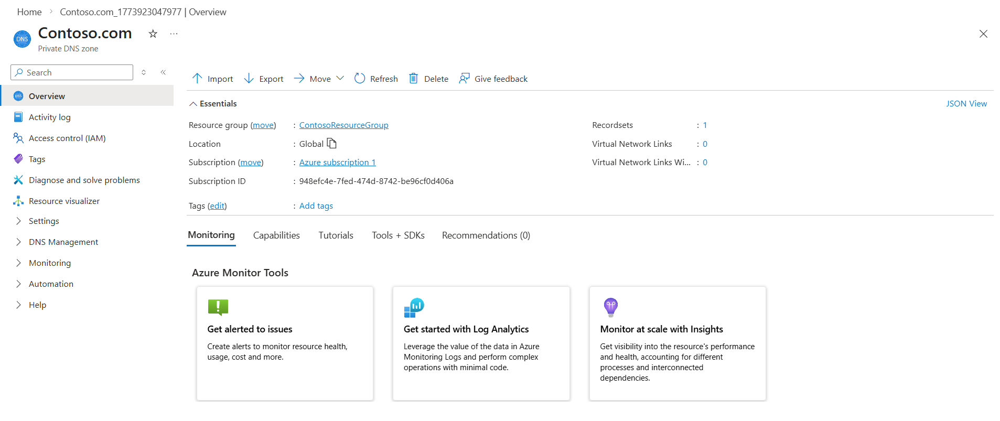
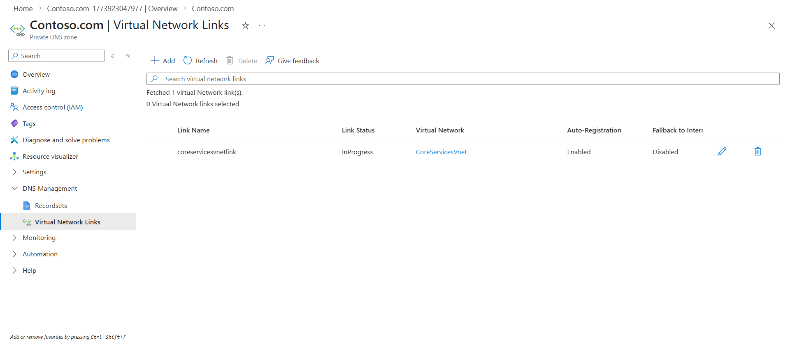
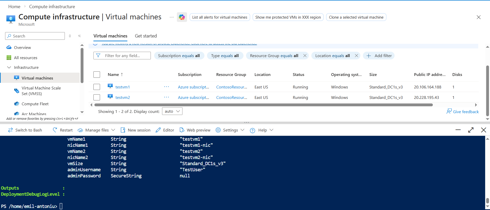
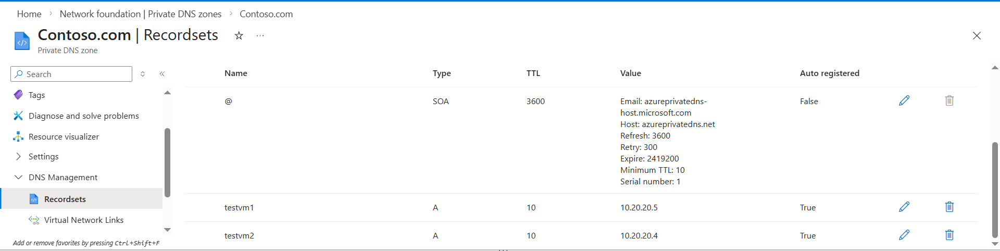
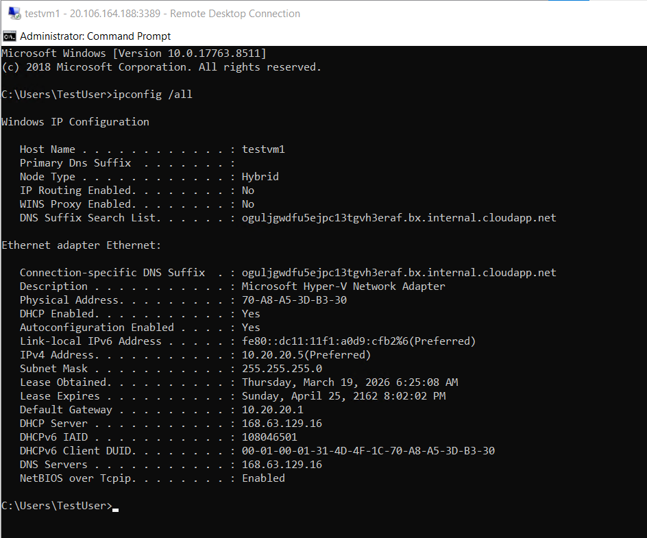
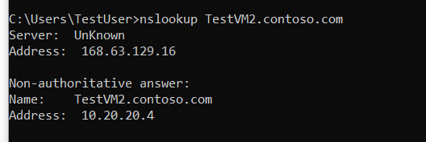

# Configure DNS settings in Azure

## Overview

Learn basic Azure DNS configurations.

## Key Activities

- Creating and configuring a private DNS Zone and verifying the DNS records for the configured zone on 2 VMs.

### Task 1: Create a private DNS Zone



### Task 2: Link subnet for auto registration



### Task 3: Create Virtual Machines to test the configuration

This step raised issues as the VM sizes requested by the lab-provided configurations were not available to me.

```PowerShell
New-AzResourceGroupDeployment: 1:02:30 PM - Error: Code=SkuNotAvailable; Message=The requested VM size for resource 'Following SKUs have failed for Capacity Restrictions: Standard_D2s_v3' is currently not available in location 'eastus'. Please try another size or deploy to a different location or different zone. See https://aka.ms/azureskunotavailable for details.
```

Was able to create the VMs by slightly adjusting the configuration files to use a different size (`Standard_DC1s_v3`), and to also account for hypervisor compatibility (had to switch from gen1 to gen2 since the former raised issues as well).

```PowerShell
New-AzResourceGroupDeployment: 1:18:21 PM - The deployment 'azuredeploy' failed with error(s). Showing 1 out of 1 error(s).
Status Message: The selected VM size 'Standard_DC1s_v3' cannot boot Hypervisor Generation '1'. If this was a Create operation please check that the Hypervisor Generation of the Image matches the Hypervisor Generation of the selected VM Size. If this was an Update operation please select a Hypervisor Generation '1' VM Size. For more information, see https://aka.ms/azuregen2vm (Code:BadRequest)
```

Changes made to `azuredeploy.json`:
```json
"defaultValue": "Standard_D2s_v3" -> "defaultValue": "Standard_DC1s_v3"
"sku": "2019-Datacenter" -> "sku": "2019-datacenter-gensecond" // For both VMs
```

Changes made to `azuredeploy.parameters.json`:
```json
"value": "Standard_D2s_v3" -> "value": "Standard_DC1s_v3"
```



### Task 4: Verify records are present in the DNS zone



### Task 5: Connect to a VM to test the name resolution




### Scripting

Useful command for finding available VM sizes.

```cli
az vm list-skus --location eastus --output table  
```

Stopping the VMs.

```PowerShell
Stop-AzVM -Name "testvm1" -ResourceGroupName "YourRG" -Force
```

Source: https://microsoftlearning.github.io/AZ-700-Designing-and-Implementing-Microsoft-Azure-Networking-Solutions/Instructions/Exercises/M01-Unit%206%20Configure%20DNS%20settings%20in%20Azure.html