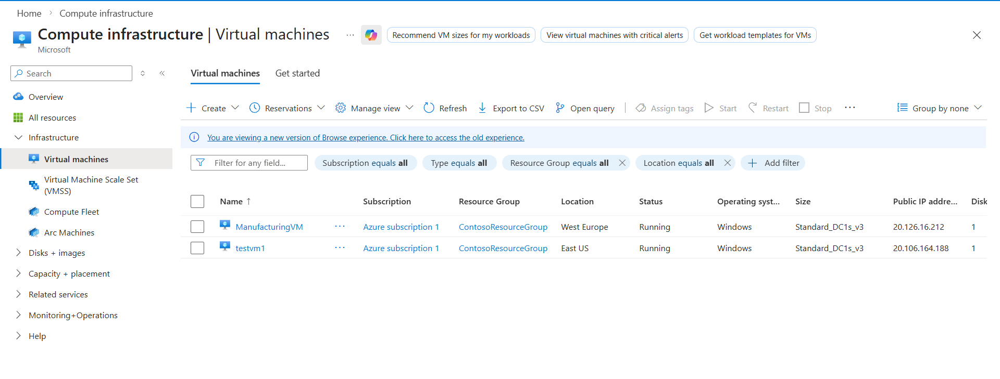
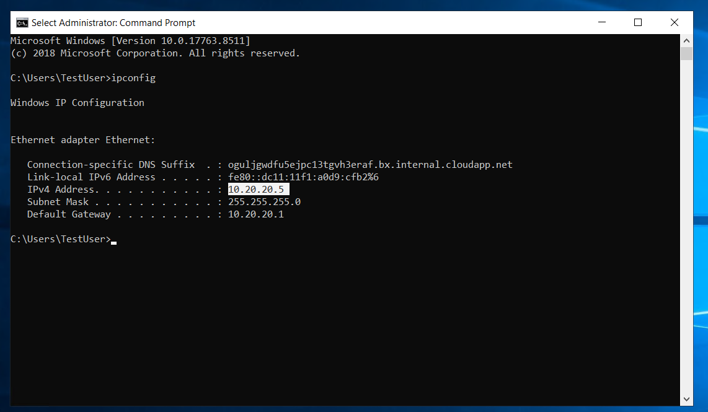
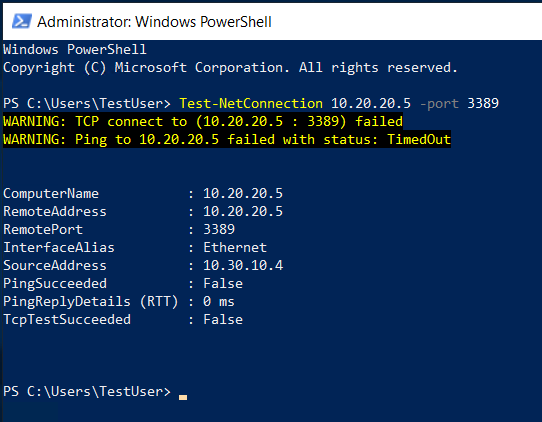
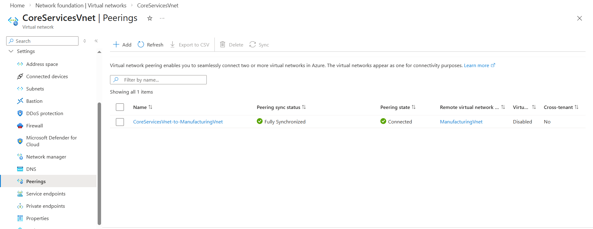
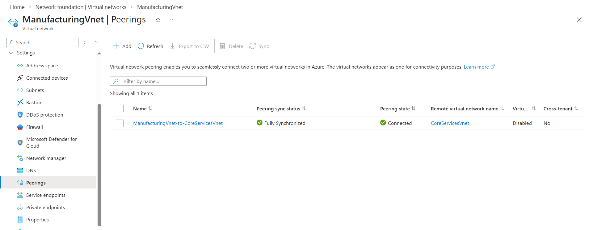
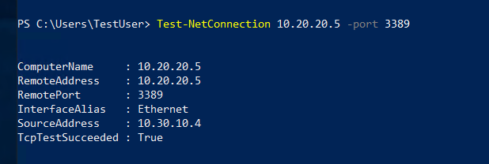

# Connect two Azure Virtual Networks using global virtual network peering

## Overview

Learn basic Azure peering.

## Key Activities

- Configuring peering between 2 VMs from separate VNets.
- Note that VNet peering in Azure is not transitive. Peering VNet1↔VNet2 and VNet2↔VNet3 does not automatically allow VNet1 to communicate with VNet3.
- Note that firewalls and gateways can affect Azure virtual network peering.

### Task 1: Create a Virtual Machine to test the configuration

Kept TestVM1 from the previous lab.

Changes made to `ManufacturingVMazuredeploy.json`:
```json
"defaultValue": "Standard_D2s_v3" -> "defaultValue": "Standard_DC1s_v3"
"sku": "2019-Datacenter" -> "sku": "2019-datacenter-gensecond"
```

Changes made to `ManufacturingVMazuredeploy.parameters.json`:
```json
"value": "Standard_D2s_v3" -> "value": "Standard_DC1s_v3"
```



### Task 2: Connect to the Test VMs using RDP



### Task 3: Test the connection between the VMs



### Task 4: Create VNet peerings between CoreServicesVnet and ManufacturingVnet




### Task 5: Test the connection between the VMs



### Scripting

Test RDP connection.

```PowerShell
Test-NetConnection IP -port 3389
```

Create resource based on deployment files.

```PowerShell
$RGName = "ContosoResourceGroup"
   
New-AzResourceGroupDeployment -ResourceGroupName $RGName -TemplateFile ManufacturingVMazuredeploy.json -TemplateParameterFile ManufacturingVMazuredeploy.parameters.json
```

Delete the resource group used for this lab.

```PowerShell
Remove-AzResourceGroup -Name 'ContosoResourceGroup' -Force -AsJob
```

Source: https://microsoftlearning.github.io/AZ-700-Designing-and-Implementing-Microsoft-Azure-Networking-Solutions/Instructions/Exercises/M01-Unit%208%20Connect%20two%20Azure%20Virtual%20Networks%20using%20global%20virtual%20network%20peering.html