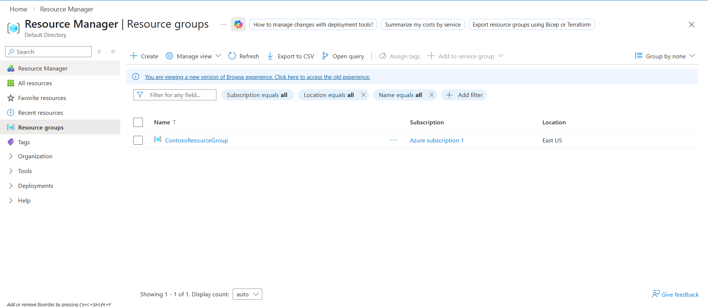
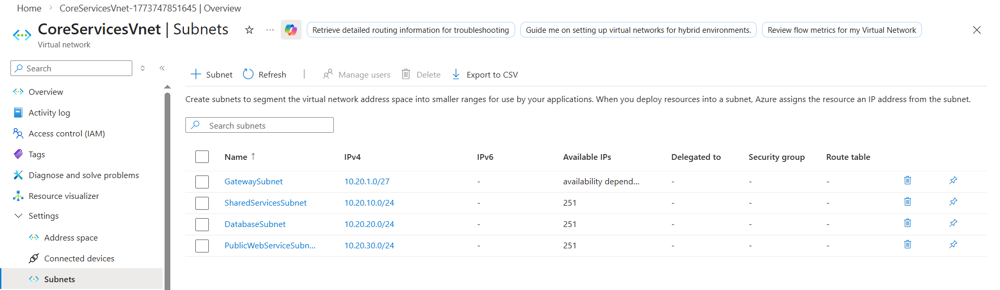
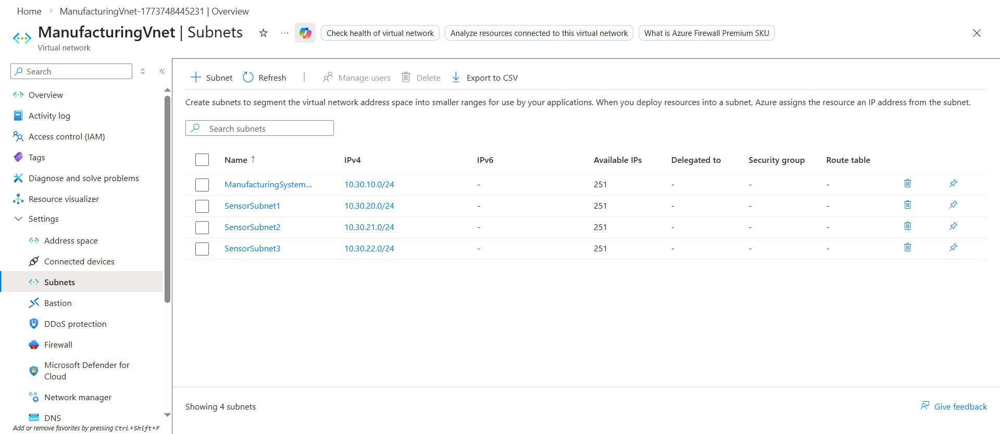
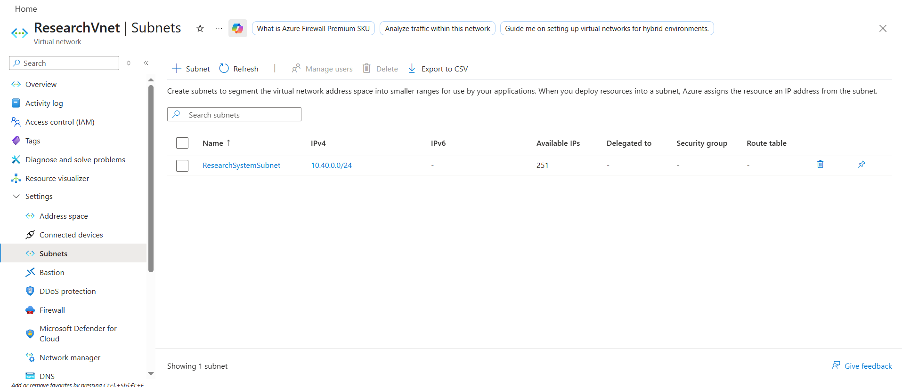
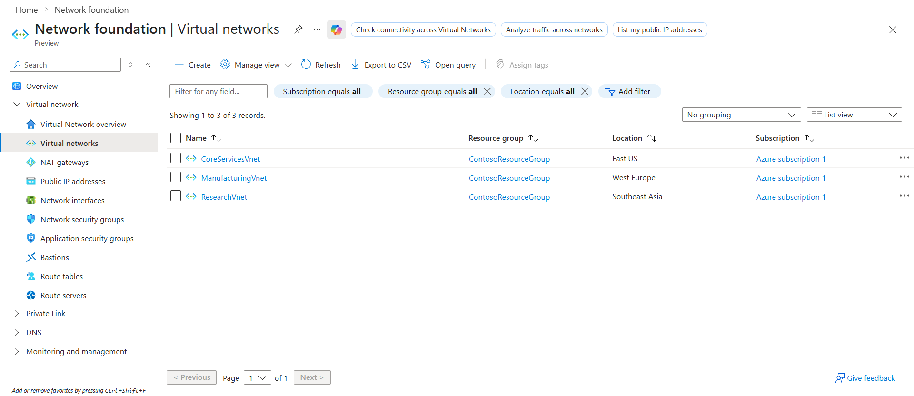

# Introduction to Azure Virtual Networks

## Overview

Learning how to create Virtual Networks and segment them with subnets on Azure.

## Key Activities

- Getting accustomed to creating simple virtual networks via the Azure GUI.

### Task 1: Create the Contoso resource group



### Task 2: Create the CoreServicesVnet virtual network and subnets



### Task 3: Create the ManufacturingVnet virtual network and subnets



### Task 4: Create the ResearchVnet virtual network and subnets



### Task 5: Verify the creation of VNets and Subnets



### Scripting

Creating VNets can be done via Azure PowerShell or CLI like so:

PowerShell (CoreServicesVnet in the East (US) region, 10.20.0.0/16 IP address space):
```PowerShell
New-AzVirtualNetwork `
  -Name "CoreServicesVnet" `
  -ResourceGroupName "<YourResourceGroupName>" `
  -Location "EastUS" `
  -AddressPrefix "10.20.0.0/16"
```

CLI (ManufacturingVnet in the West Europe region, 10.30.0.0/16 IP address space):
```cli
az network vnet create \
  --name ManufacturingVnet \
  --resource-group <YourResourceGroupName> \
  --location westeurope \
  --address-prefixes 10.30.0.0/16
```

Source: https://learn.microsoft.com/en-us/training/modules/introduction-to-azure-virtual-networks/