# Monitor a load balancer resource using Azure Monitor

## Overview

Create an internal load balancer and observe various monitoring tools in action.

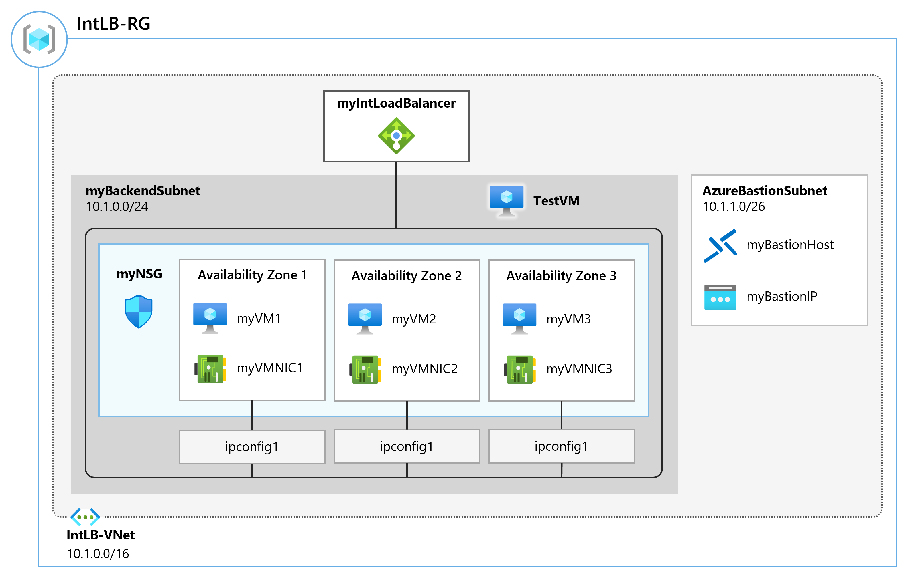

### Task 1: Create the virtual network

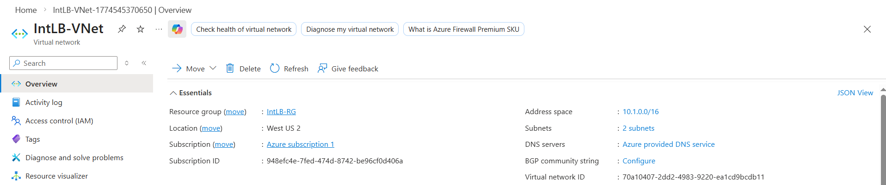

### Task 2: Create the load balancer

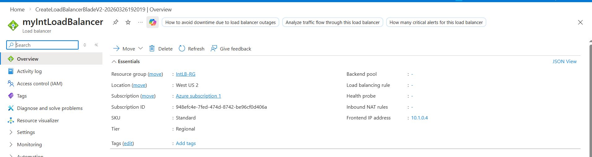

### Task 3: Create a backend pool

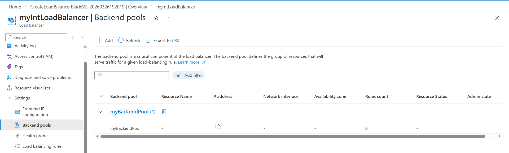

### Task 4: Create a health probe

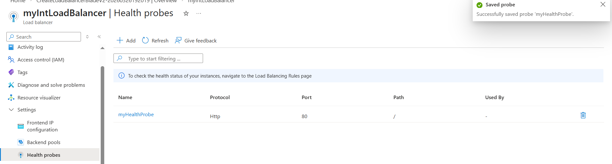

### Task 5: Create a load balancer rule

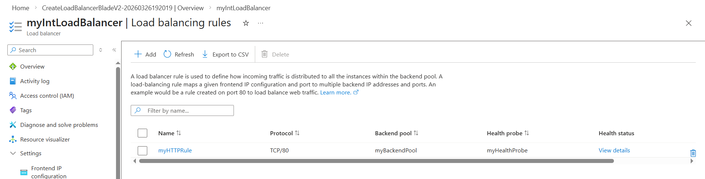

### Task 6: Create backend servers

Changes made to `azuredeploy.json`:
```json
"defaultValue": "Standard_D2s_v3" -> "defaultValue": "Standard_DC1s_v3"
"sku": "2019-Datacenter" -> "sku": "2019-datacenter-gensecond" // For both VMs
```

Changes made to `azuredeploy.parameters.json`:
```json
"value": "Standard_D2s_v3" -> "value": "Standard_DC1s_v3"
```

```PowerShell
$RGName = "IntLB-RG"

New-AzResourceGroupDeployment -ResourceGroupName $RGName -TemplateFile azuredeploy.json -TemplateParameterFile azuredeploy.parameters.json
```

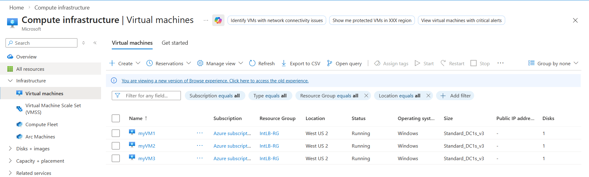

### Task 7: Add VMs to the backend pool

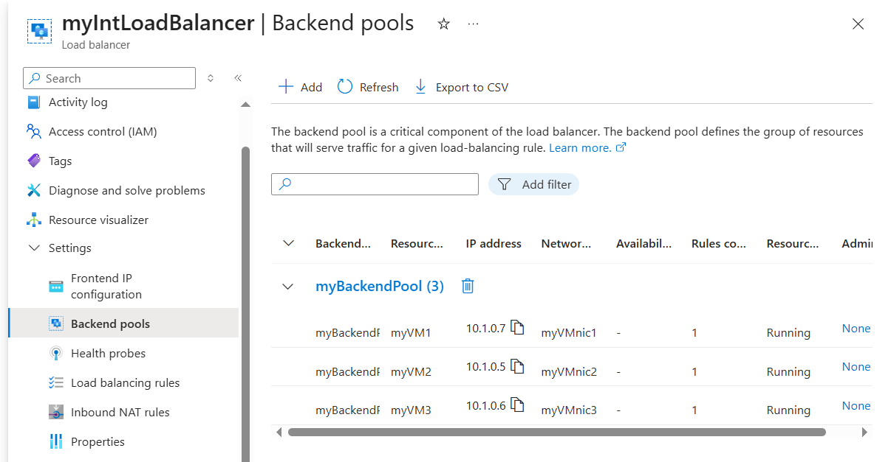

### Task 8: Test the load balancer

It did show myVM1 once.

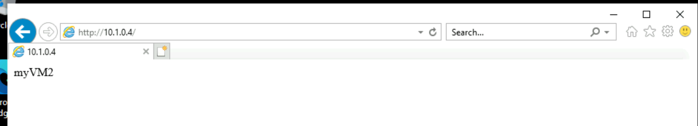

### Task 9: Create a Log Analytics Workspace

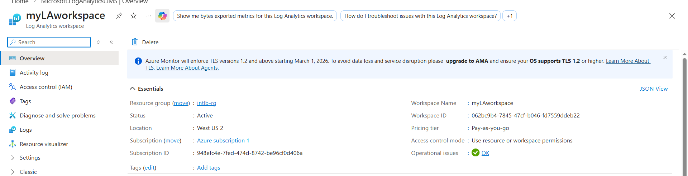

### Task 10: Use Functional Dependency View

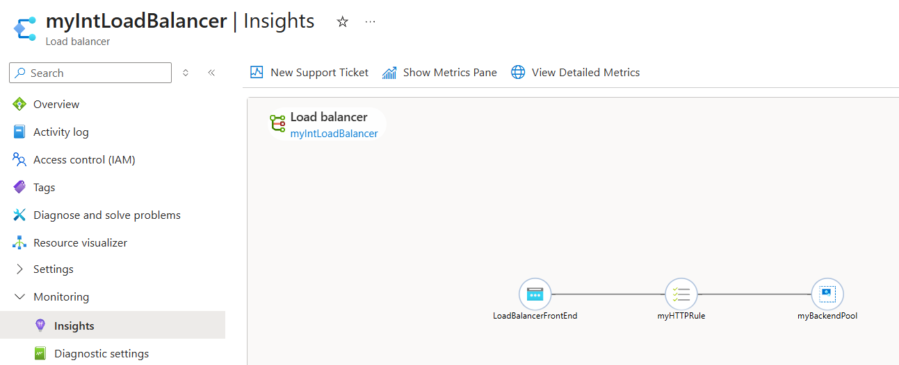

The Metrics pane provides a quick view of some key metrics for this load balancer resource, in the form of bar and line charts (or it would have had I not been a free tier in 2026).

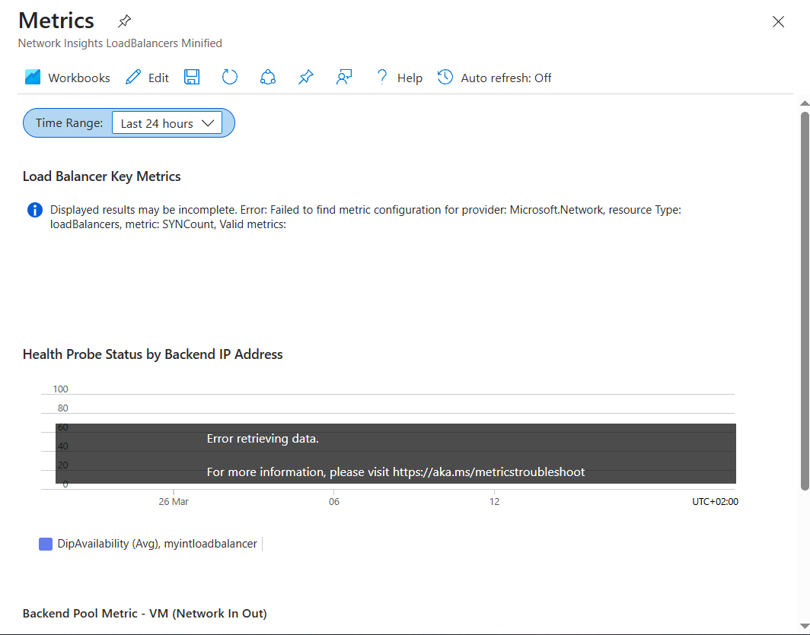

### Task 11: View detailed metrics

- **Overview**: shows the availability status of the load balancer and overall Data Throughput and Frontend and Backend Availability for each of the Frontend IPs attached to your Load Balancer. These metrics indicate whether the Frontend IP is responsive and the compute instances in your Backend Pool are individually responsive to inbound connections.

- **Frontend & Backend Availability**: Health Probe Status charts. If you see values that are lower than 100 for these items, it indicates an outage of some kind on those resources.

- **Data Throughpu**t: you will see that the values change to show the exact value at any point in time.

- **Flow Distribution**: graphical representation of the aforementioned.

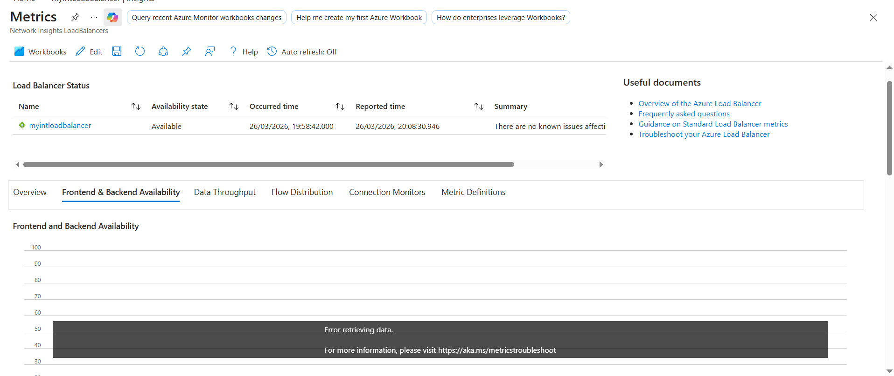

### Task 12: View resource health

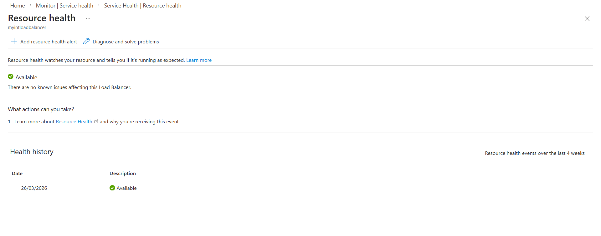

### Task 13: Configure diagnostic settings

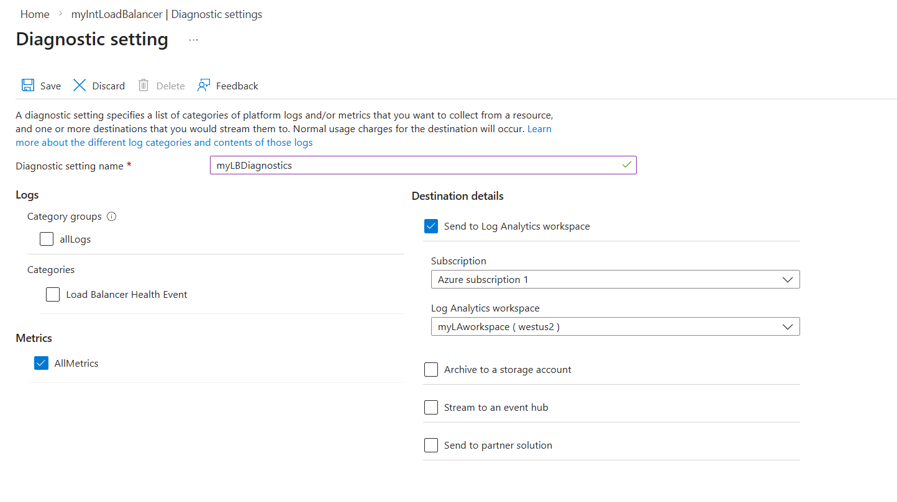

### Scripting

Clean-up after lab.

```PowerShell
Remove-AzResourceGroup -Name 'IntLB-RG' -Force -AsJob
```

Source: https://microsoftlearning.github.io/AZ-700-Designing-and-Implementing-Microsoft-Azure-Networking-Solutions/Instructions/Exercises/M08-Unit%203%20Monitor%20a%20load%20balancer%20resource%20using%20Azure%20Monitor.html